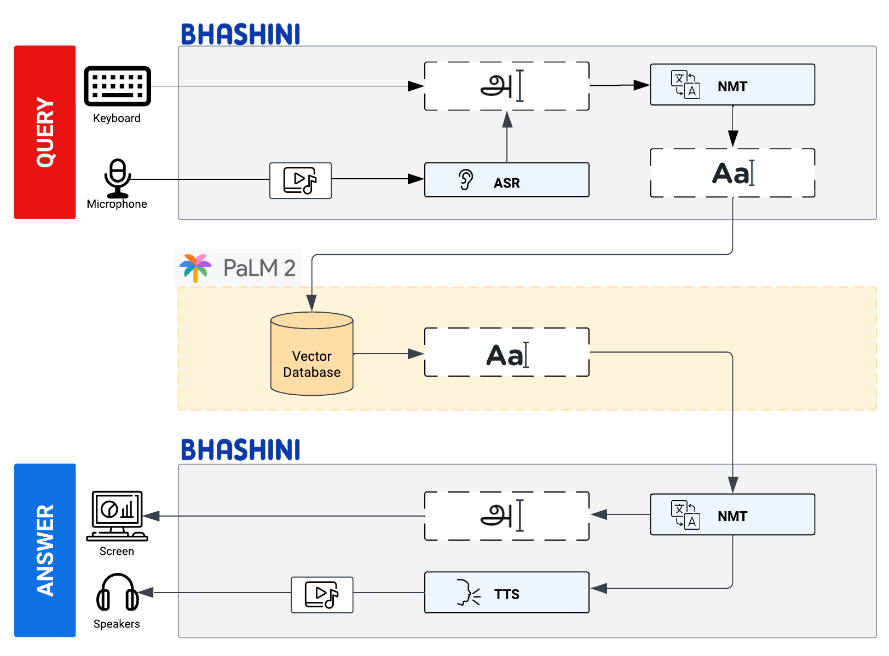

<br />
<div align="center">

  <h2 align="center">Indic Agro Advisory using PaLM API and BHASHINI</h2>

  <p align="center">
    Streamlit-powered decision support tool for Indian farmers in 14 different Indic languages, converting spoken word prompts to auditory information sourced from a large vector database.
  </p>
    <a href="https://github.com/dnezan/streamlit-hyperspectral-agri">
    
</div>
</br>

*The project is still work in progress, see the [disclaimer below](#status).*


The Agri-Advisory for Farmers project is a powerful, user-friendly Streamlit app designed to assist farmers in making informed decisions regarding agriculture practices and crop-related queries. This cutting-edge application harnesses the power of Python, Streamlit, PaLM 2, and Bhashini to provide comprehensive agricultural guidance in multiple Indian languages.

## Installation

Pip install all the package including in *requirements.txt* in a Python>=3.8 environment.
```sh
git clone https://github.com/dnezan/indic-agro-advisory
pip install requirements.txt
```
Make sure to add your **PaLM API** key as well as your **BHASHINI MeitY API** key as Streamlit Secrets if you are deploying on Streamlit Community Cloud. You can also use Azure Key Vault if you are deploying on Azure.

_config.py_
```python
secret = dict(
    palm_api_key = **********,
    BHASHINI_api_key = **********
)
```

## How does it work?
1.	Farmers access the web-based Streamlit app from their devices.
2.	They interact with the app either by speaking their questions or typing them in the text box.
3.	The app's powerful speech recognition or text processing module converts the input into a suitable format.
4.	The PaLM-based vector database is queried to fetch the most accurate and context-specific responses to the farmer's queries.
5.	The app presents the answers in both text and audio formats, catering to the user's language preference.
6.	Farmers can implement the provided advice and insights to enhance their farming practices and increase productivity.



ASR stands for **Automatic Speech Recognition**. It is the process of converting spoken language into text. ASR is used in a variety of applications, such as voice search, dictation, and closed captioning.

NMT stands for **Neural Machine Translation**. It is a type of machine translation that uses neural networks to translate text from one language to another. NMT is more accurate than traditional machine translation methods, and it is also able to handle more complex language structures.

TTS stands for **Text-to-Speech**. It is the process of converting text into spoken language. TTS is used in a variety of applications, such as e-readers, audiobooks, and voice assistants.

## Features
1.	**Multilingual Support:** Farmers can interact with the app using their preferred Indian language, either by speaking or typing their questions. The app supports a wide range of Indic languages, ensuring ease of use for farmers from diverse linguistic backgrounds.
2.	**Voice Interaction:** Leveraging advanced speech recognition, the app allows farmers to interact through spoken queries, making it accessible and user-friendly, especially for those with limited literacy skills.
3.	**Text-based Queries:** In addition to voice, farmers can also input their questions through text, making it a versatile platform that caters to various user preferences.
4.	**Comprehensive Agri-Advisory:** The app draws upon an extensive vector database to provide accurate and contextually relevant answers to farmers' questions. Powered by PaLM, a robust pre-trained language model, the responses are highly informative and up-to-date.
5.	**Text and Audio Responses:** The app ensures a holistic user experience by providing answers in both text and audio formats. Users can either read the response or listen to it in their chosen language, enhancing accessibility and convenience.
6.	**Real-time Updates:** The Agri-Advisory for Farmers app is regularly updated with the latest agricultural insights and practices, ensuring that farmers receive the most relevant information to optimize their crop yield and farming success.
7.	**User-Friendly Interface:** The intuitive Streamlit-based interface makes navigation seamless, allowing users to effortlessly seek guidance on diverse agricultural topics without any technical hurdles.


## Why not just use GPT 4?

Good question.

PaLM 2 is a powerful new language model that has the potential to compete with GPT-4 and help Google in the AI race.

PaLM 2 is a newer model than GPT-4, and it has been trained on a larger dataset of text and code. This means that PaLM 2 has the potential to be more powerful and versatile than GPT-4.
PaLM 2 is also open source, which means that it is available to anyone to use and improve. 

## Language Support

Let us examine the capabilities of our proposed pipeline using PaLM 2 + BHASHINI.

_Text querying_
| Indic Language | GPT4 | PaLM 2  | PaLM 2 + BHASHINI |
|---|---|---|---|
| English | ✅ | ✅ | ✅ |
| Bengali | ✅ | ✅ | ✅ |
| Bodo | ❌ | ❌ | ✅ |
| Assamese | ✅ | ❌ | ✅ |
| Gujarati | ✅ | ✅ | ✅ |
| Hindi | ✅ | ❌ | ✅ |
| Kannada | ✅ | ❌ | ✅ |
| Malayalam | ✅ | ❌ | ✅ |
| Manipuri | ✅ | ❌ | ✅ |
| Marathi | ✅ | ✅ | ✅ |
| Oriya | ✅ | ❌ | ✅ |
| Punjabi | ✅ | ❌ | ✅ |
| Tamil | ✅ | ✅ | ✅ |
| Telegu | ✅ | ✅ | ✅ |
| Urdu | ✅ | ❌ | ✅ |

Whisper API and BHASHINI API are both popular APIs for ASR applications. However, there are some key differences between the two APIs.

**Language support:** BHASHINI supports 14 Indic languages, while Whisper API only supports 5. This makes BHASHINI a more attractive option for developers who need to support a wider range of languages.

**Pipeline:** BHASHINI-PaLM 2-BHASHINI is an open-source pipeline that combines BHASHINI with PaLM 2, a large language model. This pipeline is capable of producing high-quality results with high speed. Whisper API, on the other hand, is a closed-source pipeline.

**API calls:** BHASHINI can be used to perform ASR, NMT, and TTS with a single API call. This makes BHASHINI a more efficient API for developers who need to perform multiple tasks. 


## Conclusion

BHASHINI is a powerful open-source API for ASR/NMT/TTS applications. It supports a wider range of languages than Whisper API, and it can be used to perform multiple tasks with a single API call. If you are looking for an API that can support a wide range of languages and tasks, BHASHINI is a good option.