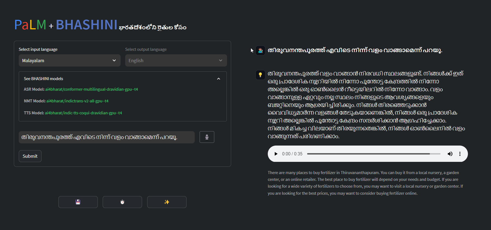

<br />
<div align="center">

  <h2 align="center">Indic Agro Advisory using PaLM API and BHASHINI</h2>

  <p align="center">
    Streamlit-powered decision support tool for Indian farmers in 14 different Indic languages, converting spoken word prompts to auditory information sourced from a large vector database.
  </p>
    <a href="https://github.com/dnezan/streamlit-hyperspectral-agri">
    
</div>
</br>

*The project is still work in progress, see the [disclaimer below](#status).*



## Installation

Pip install all the package including in *requirements.txt* in a Python>=3.8 environment.
```sh
git clone https://github.com/dnezan/indic-agro-advisory
pip install requirements.txt
```
Make sure to add your **PaLM API** key as well as your **BHASHINI MeitY API** key as Streamlit Secrets if you are deploying on Streamlit Community Cloud. You can also use Azure Key Vault if you are deploying on Azure.

_config.py_
```python
secret = dict(
    palm_api_key = **********,
    BHASHINI_api_key = **********
)
```

## Why not just use GPT 4?

Good question.

PaLM 2 is a powerful new language model that has the potential to compete with GPT-4 and help Google in the AI race.

PaLM 2 is a newer model than GPT-4, and it has been trained on a larger dataset of text and code. This means that PaLM 2 has the potential to be more powerful and versatile than GPT-4.
PaLM 2 is also open source, which means that it is available to anyone to use and improve. 

## Language Support

Let us examine the capabilities of our proposed pipeline using PaLM 2 + BHASHINI.

_Text querying_
| Indic Language | GPT4 | PaLM 2  | PaLM 2 + BHASHINI |
|---|---|---|---|
| English | ✅ | ✅ | ✅ |
| Bengali | ✅ | ✅ | ✅ |
| Bodo | ❌ | ❌ | ✅ |
| Assamese | ✅ | ❌ | ✅ |
| Gujarati | ✅ | ✅ | ✅ |
| Hindi | ✅ | ❌ | ✅ |
| Kannada | ✅ | ❌ | ✅ |
| Malayalam | ✅ | ❌ | ✅ |
| Manipuri | ✅ | ❌ | ✅ |
| Marathi | ✅ | ✅ | ✅ |
| Oriya | ✅ | ❌ | ✅ |
| Punjabi | ✅ | ❌ | ✅ |
| Tamil | ✅ | ✅ | ✅ |
| Telegu | ✅ | ✅ | ✅ |
| Urdu | ✅ | ❌ | ✅ |

Whisper API and BHASHINI API are both popular APIs for ASR applications. However, there are some key differences between the two APIs.

**Language support:** BHASHINI supports 14 Indic languages, while Whisper API only supports 5. This makes BHASHINI a more attractive option for developers who need to support a wider range of languages.

**Pipeline:** BHASHINI-PaLM 2-BHASHINI is an open-source pipeline that combines BHASHINI with PaLM 2, a large language model. This pipeline is capable of producing high-quality results with high speed. Whisper API, on the other hand, is a closed-source pipeline.

**API calls:** BHASHINI can be used to perform ASR, NMT, and TTS with a single API call. This makes BHASHINI a more efficient API for developers who need to perform multiple tasks. 

## Features
Vector database querying, text input via typing or recording audio, returns answer in both chosen language and english, saves and displays history of prompts, generates audio response.

## Conclusion

BHASHINI is a powerful open-source API for ASR/NMT/TTS applications. It supports a wider range of languages than Whisper API, and it can be used to perform multiple tasks with a single API call. If you are looking for an API that can support a wide range of languages and tasks, BHASHINI is a good option.